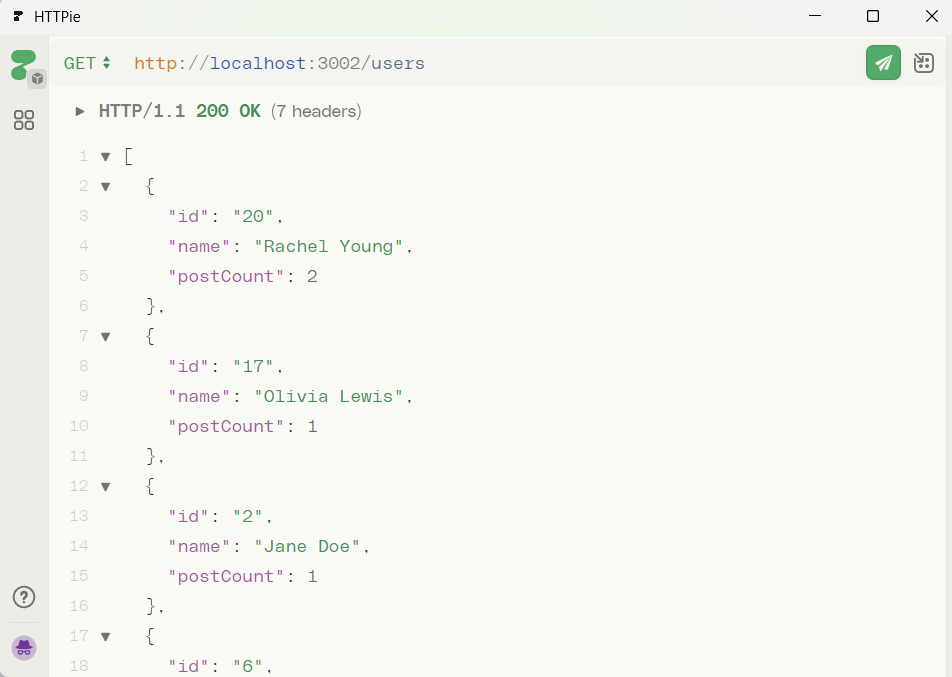
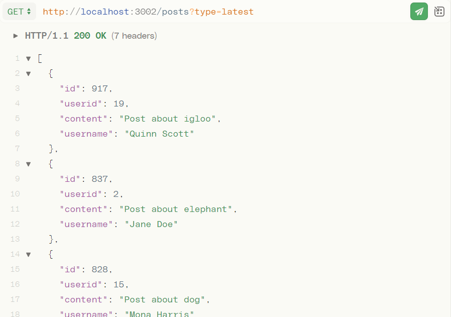
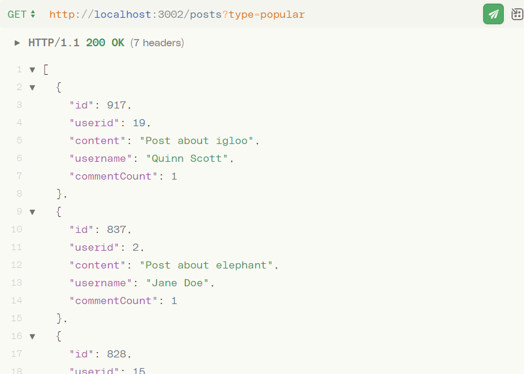

# Backend Documentation

## Overview

This backend service provides API endpoints for retrieving user and post data from an external API source. It implements several performance optimization techniques including:

1. **Authentication Caching** - Stores authentication tokens to reduce API calls.
2. **Data Caching** - Caches user and post data with configurable TTL values.
3. **Heap-based Sorting** - Uses heap data structures for efficient data filtering.
4. **Scheduled Updates** - Automatically refreshes cache data via cron jobs.

## Technologies Used

- Node.js with Express
- Authentication with JWT tokens
- In-memory caching with NodeCache
- Scheduled tasks with node-schedule
- Heap data structures for efficient data processing

## Performance Optimizations

### Heap Data Structures

The application uses custom heap implementations to efficiently process data:

1. **MinHeap for Top Users**
   - Maintains a min-heap of users sorted by post count.
   - Efficiently finds top N users without sorting the entire dataset.
   - Time complexity: O(n log 5) instead of O(n log n).

2. **MaxHeap for Latest Posts**
   - Uses post ID as key to find the most recent posts.
   - Extracts only the 5 highest IDs without sorting all posts.

3. **MaxHeap for Popular Posts**
   - Organizes posts by comment count.
   - Efficiently finds posts with the highest number of comments.

### Caching Strategy

- **Tiered Caching**: Different TTL values for different data types:
  - Users cache: 300 seconds (5 minutes).
  - Posts cache: 120 seconds (2 minutes).
  
- **Automatic Cache Invalidation**: NodeCache handles TTL expirations.

### Scheduled Tasks

- **Token Refresh**: Schedules token refresh before expiration.
- **Post Data Updates**: Every 180 seconds (3 minutes).
- **User Data Updates**: Every 600 seconds (10 minutes).
- **Initial Prefetch**: Loads data into cache during startup.

## API Endpoints

### 1. Get Top Users

```
GET /users
```

Returns the top 5 users based on their post count.

**Response Format:**
```json
[
  {
    "id": "user_id",
    "name": "User Name",
    "postCount": 10
  },
  ...
]
```

**Screenshot:**


### 2. Get Latest Posts

```
GET /posts?type=latest
```

Returns the 5 most recent posts based on post ID.

**Response Format:**
```json
[
  {
    "id": 123,
    "title": "Post Title",
    "username": "User Name",
    "content": "Post content..."
  },
  ...
]
```

**Screenshot:**


### 3. Get Popular Posts

```
GET /posts?type=popular
```

Returns posts with the highest number of comments.

**Response Format:**
```json
[
  {
    "id": 123,
    "title": "Post Title",
    "username": "User Name",
    "content": "Post content...",
    "commentCount": 15
  },
  ...
]
```

**Screenshot:**


## Environment Configuration

The application requires the following environment variables:

```
TEST_SERVER_URL=http://api-base-url
PORT=3002
CACHE_TTL_USERS=300
CACHE_TTL_POSTS=120
COMPANY_NAME=yourCompany
CLIENT_ID=yourClientId
CLIENT_SECRET=yourClientSecret
OWNER_NAME=Your Name
OWNER_EMAIL=your.email@example.com
ROLL_NO=yourRollNumber
```

## Running the Application

```bash
# Install dependencies
npm install

# Start the server
npm start

# Development mode with auto-restart
npm run dev
```
